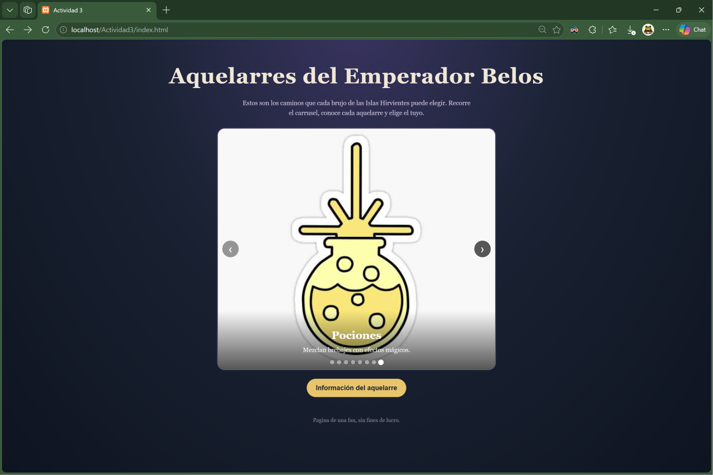
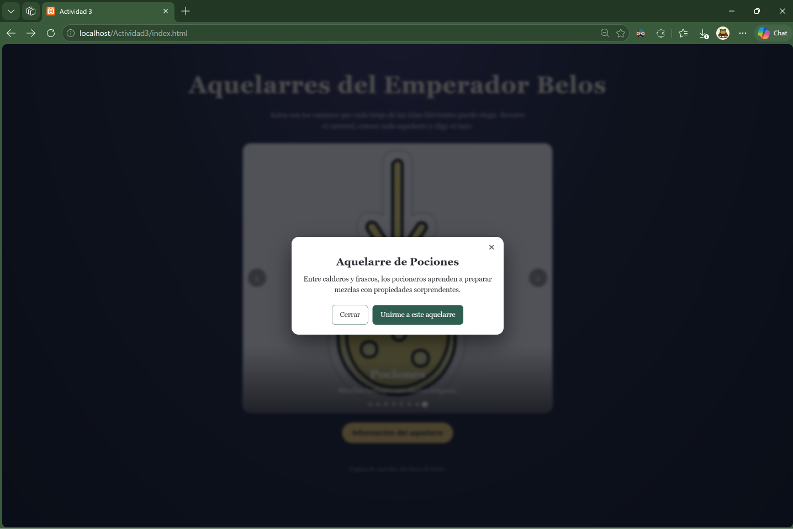
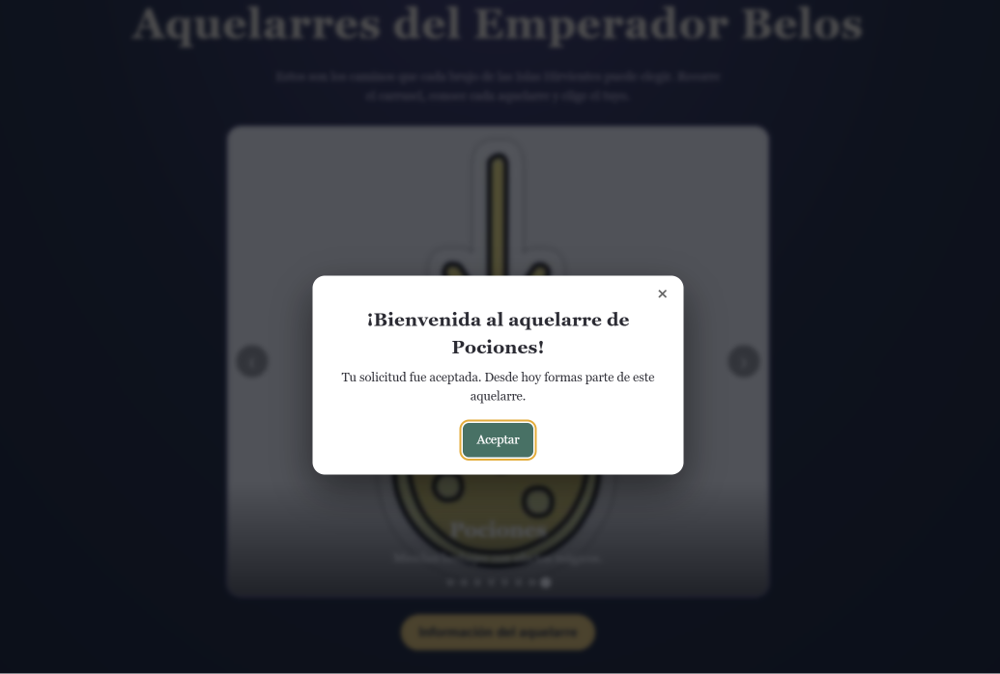
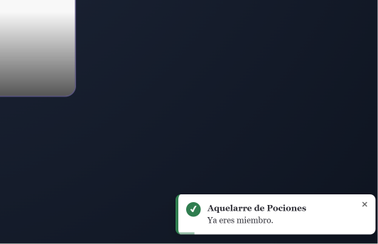

# COMPONENTES - ACTIVIDAD 3

## Portada

Hayley Cortés - Instituto Tecnológico de Oaxaca
Programación Web

Tres componentes visuales reutilizables hechos con **JavaScript, HTML y CSS puros** (sin frameworks): **Toast** (avisos emergentes), **Modal** (ventanas emergentes) y **Carrusel** (diapositivas con imágenes).

**Qué problema resuelve:** en cada página nueva se repite el mismo código para mostrar avisos, ventanas y galerías, o se recurre a `alert()`, que bloquea la página y se ve mal. Con estos componentes se hace con una sola llamada y se personaliza con parámetros, sin escribir contenido fijo dentro del componente.

La demostración es una página de fans sobre los aquelarres de las Islas Hirvientes de *The Owl House*: un carrusel con los 8 aquelarres, un modal con la información de cada uno, y avisos al unirse o salir.


## Instalación

Copia `css/componente.css` y `js/componente.js` a tu proyecto e inclúyelos en tu HTML. El script del componente debe ir **antes** del tuyo:

```html
<link rel="stylesheet" href="css/componente.css">
<script src="js/componente.js" defer></script>
<script src="js/tu-script.js" defer></script>
```

## Uso

### 1. Toast

```js
// Aviso completo
Toast.mostrar({
  titulo: "Aquelarre de Plantas",
  mensaje: "Ya eres miembro de este aquelarre.",
  tipo: "exito",              // "exito" | "error" | "aviso" | "info"
  posicion: "abajo-derecha",  // arriba-derecha, arriba-izquierda, abajo-derecha, abajo-izquierda
  duracion: 5000              // milisegundos; 0 = no se cierra solo
});

// Atajos
Toast.exito("Cambios guardados");
Toast.error("No se pudo conectar", { posicion: "arriba-izquierda" });
Toast.limpiar(); // cierra todos los avisos
```

### 2. Modal

```js
Modal.abrir({
  icono: "🌱",                                   // opcional
  titulo: "Aquelarre de Plantas",
  contenido: "Cultivan y dirigen la vida vegetal.", // texto o un elemento del DOM
  botones: [
    { texto: "Cerrar" },
    { texto: "Unirme", principal: true, alHacerClic: () => Toast.exito("¡Listo!") }
  ]
});
```

El modal se cierra con la ×, con la tecla Esc, al hacer clic fuera o al pulsar cualquiera de sus botones.

### 3. Carrusel

```html
<div id="aquelarres"></div>
```

```js
const carrusel = new Carrusel("#aquelarres", {
  diapositivas: [
    { titulo: "Curación", subtitulo: "Sanan heridas con magia.", imagen: "img/curacion.jpg" },
    { titulo: "Bardos", subtitulo: "Magia con música.", imagen: "img/bardos.jpg" }
  ],
  alCambiar: (indice, diapositiva) => console.log(indice, diapositiva.titulo)
});

carrusel.diapositivaActual(); // la diapositiva que se ve ahora
carrusel.siguiente();
carrusel.anterior();
carrusel.ir(3);
```

Se puede recorrer con las flechas, con los puntos de abajo o con las teclas ← →.

### Los tres juntos (código de la demo)

```js
// Botón "Información": modal con los datos del aquelarre visible en el carrusel
document.getElementById("info").addEventListener("click", () => {
  const a = carrusel.diapositivaActual();
  Modal.abrir({
    titulo: "Aquelarre de " + a.titulo,
    contenido: a.detalle,
    botones: [
      { texto: "Cerrar" },
      { texto: "Unirme a este aquelarre", principal: true, alHacerClic: unirse }
    ]
  });
});

// Modal de confirmación y luego un toast que se cierra solo
function unirse() {
  const a = carrusel.diapositivaActual();
  Modal.abrir({
    titulo: "¡Bienvenida al aquelarre de " + a.titulo + "!",
    contenido: "Tu solicitud fue aceptada.",
    botones: [{
      texto: "Aceptar", principal: true,
      alHacerClic: () => Toast.mostrar({
        titulo: "Aquelarre de " + a.titulo,
        mensaje: "Ya eres miembro de este aquelarre.",
        tipo: "exito", posicion: "abajo-derecha", duracion: 5000
      })
    }]
  });
}

// Botón "Salir": toast que indica de qué aquelarre saliste
document.getElementById("salir").addEventListener("click", () => {
  const a = carrusel.diapositivaActual();
  Toast.mostrar({
    titulo: "Aquelarre de " + a.titulo,
    mensaje: "Saliste de este aquelarre.",
    tipo: "aviso", posicion: "abajo-derecha", duracion: 5000
  });
});
```

## Opciones

### `Toast.mostrar(opciones)`

| Opción | Valores | Por defecto | Descripción |
|---|---|---|---|
| `titulo` | texto | vacío | Título en negritas (opcional) |
| `mensaje` | texto | vacío | Contenido del aviso |
| `tipo` | `"exito"`, `"error"`, `"aviso"`, `"info"` | `"info"` | Color e ícono |
| `duracion` | milisegundos | `4000` | `0` = no se cierra solo |
| `posicion` | `"arriba-derecha"`, `"arriba-izquierda"`, `"abajo-derecha"`, `"abajo-izquierda"` | `"arriba-derecha"` | Esquina donde aparece |

### `Modal.abrir(opciones)`

| Opción | Valores | Descripción |
|---|---|---|
| `icono` | texto o emoji | Símbolo sobre el título (opcional) |
| `titulo` | texto | Título de la ventana |
| `contenido` | texto o elemento del DOM | Cuerpo del modal |
| `botones` | lista de `{ texto, principal, alHacerClic }` | Botones del pie; si no hay, muestra "Cerrar" |

### `new Carrusel(selector, opciones)`

| Opción | Descripción |
|---|---|
| `diapositivas` | Lista de `{ titulo, subtitulo, imagen }`. Si no hay `imagen`, usa un fondo de degradado con `glifo`, `color1` y `color2` |
| `alCambiar` | Función que recibe `(indice, diapositiva)` cada vez que cambia la diapositiva |

## Personalizar los colores

Los componentes usan variables CSS al inicio de `componente.css`. Puedes sobrescribirlas desde tu propio CSS:

```css
:root {
  --c-primario: #2f5d50;     /* botón principal del modal */
  --c-exito: #2f7d4f;
  --c-error: #c62828;
  --c-aviso: #b7791f;
  --c-info: #3a6ea5;
  --c-superficie: #ffffff;   /* fondo de toasts y modales */
  --c-fuente: Georgia, serif;
}
```

## Estructura del repositorio

```
/
├── README.md
├── index.html
├── css/
│   ├── componente.css   ← estilos de Toast, Modal y Carrusel
│   └── index.css        ← estilos de la página de demostración
├── js/
│   ├── componente.js    ← Toast, Modal y Carrusel (reutilizable)
│   └── index.js         ← datos y botones de la demostración
└── img/                 ← imágenes de los aquelarres
```

`componente.css` y `componente.js` son el componente y no saben nada del tema de la página. `index.js` e `index.css` son la demostración: le pasan los datos a los componentes.

## Capturas de pantalla

Carrusel con los aquelarres:



Modal con la información del aquelarre:



Modal de Bienvenida:



Toast de éxito:



## GitPage

## Video 

_Pega aquí el link del video (máx. 1 minuto)._

### Aclaraciones
Página de fans sin fines de lucro. *The Owl House* pertenece a Dana Terrace y Disney.